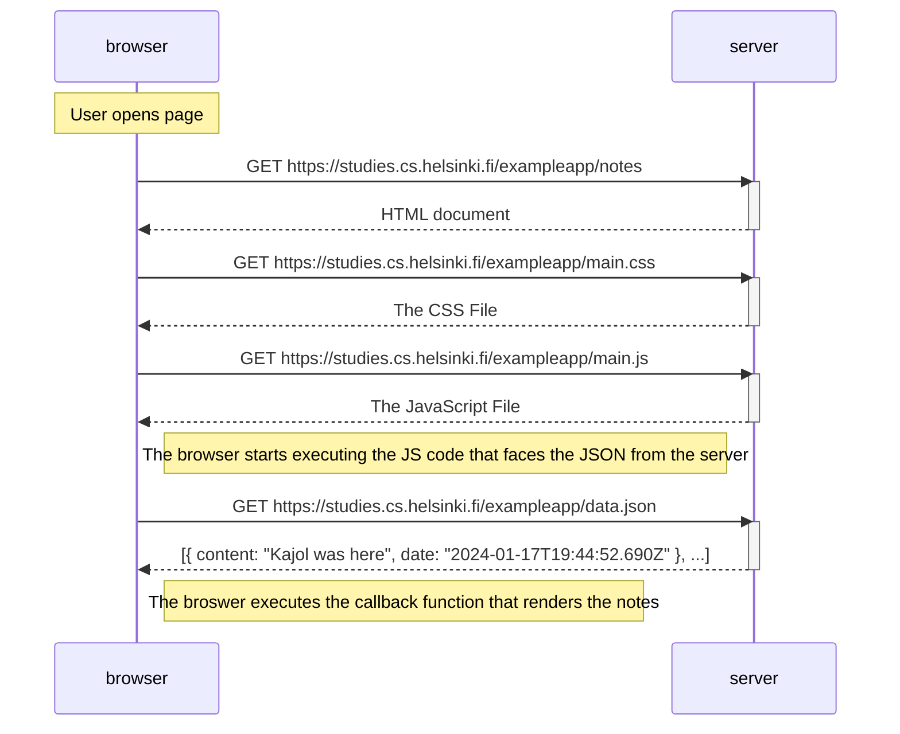

```mermaid
sequenceDiagram
    participant browser
    participant server


    note over browser: User opens page

    browser->>server: GET https://studies.cs.helsinki.fi/exampleapp/notes
    activate server
    server-->>browser: HTML document
    deactivate server

    browser->>server: GET https://studies.cs.helsinki.fi/exampleapp/main.css
    activate server
    server-->>browser: The CSS File
    deactivate server

    browser->>server: GET https://studies.cs.helsinki.fi/exampleapp/main.js
    activate server
    server-->>browser: The JavaScript File
    deactivate server

    Note right of browser: The browser starts executing the JS code that faces the JSON from the server

    browser->>server: GET https://studies.cs.helsinki.fi/exampleapp/data.json
    activate server
    server-->>browser: [{ content: "Kajol was here", date: "2024-01-17T19:44:52.690Z" }, ...]
    deactivate server

    Note right of browser: The broswer executes the callback function that renders the notes

```
